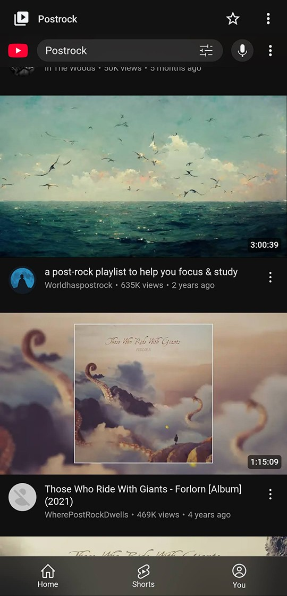
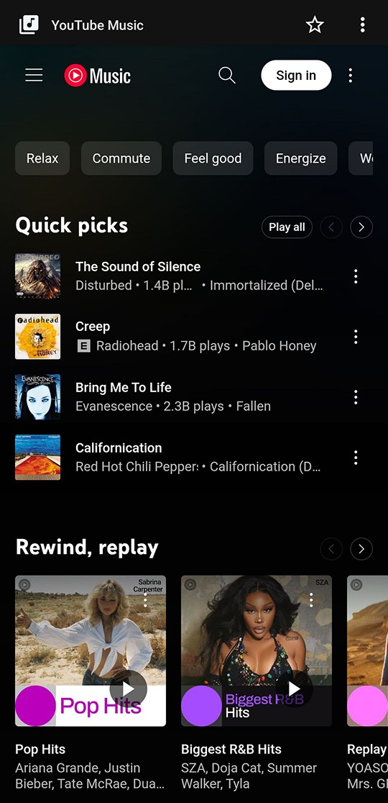
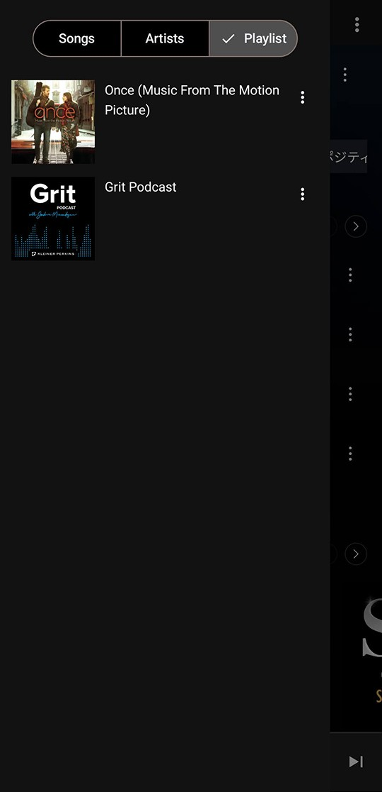

# NouTube

Android and Desktop app for YouTube and YouTube Music.

Install from F-Droid, or download APK from GitHub.

Find Linux, macOS, Windows versions in [NouTube-Desktop](https://github.com/nonbili/NouTube-Desktop).

## Features

- No ads
- Plays in the background
- Manage video/music library without login
- Manage watch history without login
- Hide shorts
- Live chat
- Play original audio

## How it works

- Wrap https://m.youtube.com and https://music.youtube.com in Android webview
- Inject code to block ads
- Hook playback controls and support playing in background

## Screenshots

  

## Contributing

You can find [contributing instructions here](/CONTRIBUTING.md)

## Translation

Translation is supported by [Weblate](https://hosted.weblate.org/projects/noutube).
